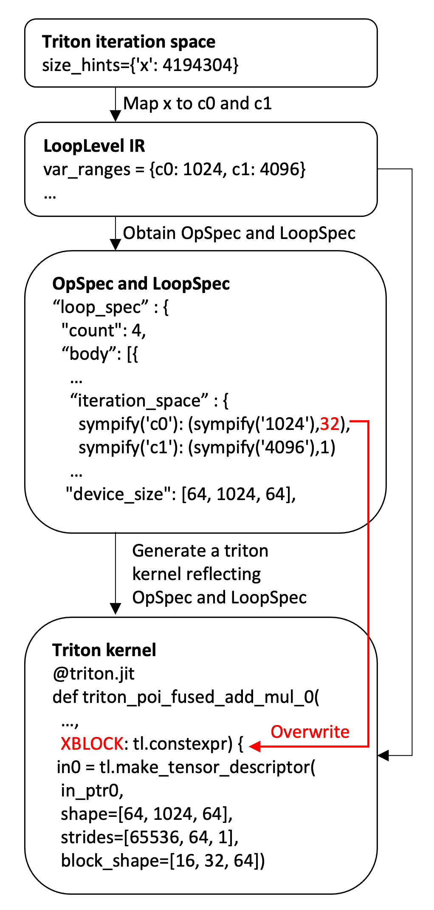

# Reflecting Physical Tensor Layouts in Triton Kernels

## Background

Spyre stores tensors in a **tiled physical layout** that differs from the
flat row-major layout assumed by upstream Triton.  Each fp16 tensor is
stored in 128-byte *sticks* (64 elements per stick), and the hardware
addresses memory through a multi-dimensional device coordinate system
(e.g., `[sticks, rows, intra-stick]`).

Standard Triton kernels use `tl.load` / `tl.store` with a 1D flat pointer
arithmetic — they assume that element `[i, j]` of a `[M, N]` tensor lives
at offset `i * N + j`.  This does not match Spyre's tiled memory layout.
Without layout-aware code generation, every Triton kernel would require a
post-compilation MLIR pass to rewrite flat accesses into multi-dimensional
tensor descriptor operations.

## Design Overview

`SpyreTritonKernel` eliminates the MLIR rewriting step by generating
layout-aware Triton code directly during Python-level code generation.
It inherits from `TritonKernel` (to generate Triton IR) and calls
`SpyreKernel` functions to create `OpSpec` and `LoopSpec` metadata.  It then
emits `tl.make_tensor_descriptor` calls that encode the N-dimensional
device layout, producing truly multi-dimensional memory accesses without
any separate MLIR pass.


*`SpyreTritonKernel` inherits from `TritonKernel` and calls
`SpyreKernel` functions to obtain `OpSpec` / `LoopSpec` metadata.*

The kernel generation involves three key computations:

1. **Compute the device shape (`block_shape`) from `device_size`,
   `iteration_space`, and `LoopSpec`** — `tl.make_tensor_descriptor`
   requires a `block_shape` that reflects the per-program tile geometry.
   This shape is derived from `device_size` (the full device-space tensor
   shape) by dividing each device dimension by the core divisor from
   `iteration_space`, and then further dividing by any active `LoopSpec.count`
   for symbols that are tiled by a coarse-tiling loop.

2. **Compute offsets into the device shape from `iteration_space` and
   `LoopSpec`** — The flat Triton iteration index is decomposed into
   per-dimension scalar starting offsets using `IterationRangesEntry`
   expressions from `iteration_space`.  These original-space offsets are
   substituted into the `device_coordinates` expressions to produce one
   device-space offset per device dimension.  When a `LoopSpec` is
   active, the offsets for tiled symbols advance by
   `(total / core_div) / loop_count` elements per iteration.

3. **Generate a tiling loop from `LoopSpec`** — When a `LoopSpec` wraps
   `OpSpec` entries, the kernel emits an explicit `for` loop whose trip
   count is `LoopSpec.count`.  Each iteration recomputes the device
   offsets for tiled symbols based on the loop variable.  Tensor
   descriptors whose `shape`, `strides`, and `block_shape` are
   loop-invariant are hoisted outside the loop; only the offset arguments
   to `load_tensor_descriptor/store_tensor_descriptor` change per iteration.



*The three-stage kernel generation pipeline: map the flat Triton
iteration space to OpSpec symbols, obtain device layout metadata, and
emit a Triton kernel with `tl.make_tensor_descriptor` calls.*

## SpyreTritonKernel Implementation

### The Three-Level Dimension Mapping

The core algorithm performs a three-level dimension mapping:

```
Level 1 (Triton shape)   — flat ≤3D index from Triton's iteration space
Level 2 (Original shape) — per-original-dim offsets from iteration_space
Level 3 (Device shape)   — device_size from SpyreTensorLayout
```

#### Level 1 → Level 2: Scalar Starting Offsets

`TritonKernel` already decomposes the flat iteration index into
per-dimension entries in its preamble:

```python
xoffset = tl.program_id(0) * XBLOCK          # scalar — this program's base
xindex  = xoffset + tl.arange(0, XBLOCK)     # vector — all elements
x0      = xindex % S1                         # vector — c1 index
x1      = xindex // S1                        # vector — c0 index
```

`SpyreTritonKernel` reuses these `IterationRangesEntry` expressions but
substitutes the **scalar** `xoffset` for the vectorized `xindex` to obtain
scalar starting offsets for each original dimension:

```python
d1 = xoffset % S1    # scalar start of c1 for this program
d0 = xoffset // S1   # scalar start of c0 for this program
```

This is valid because `xoffset = pid * XBLOCK` is always a multiple of
each per-dim tile size.  The decomposition structure (moduli, divisors)
is read directly from the existing `IterationRangesEntry.expr` objects.

For reduction dimensions, the same substitution applies using the scalar
loop variable `r0_offset` in place of the vectorized `rindex`.

#### Level 2 → Level 3: Device Coordinate Evaluation

`device_coordinates` from `TensorArg` provides one sympy expression per
device dimension.  Substitute the Level-2 offsets to obtain device-space
offsets:

```python
device_offsets[k] = device_coordinates[k].subs({c0: d0, c1: d1, ...})
```

For example, with `device_coordinates = [floor(c1/64), c0, c1 % 64]`:

```python
off0 = d1 // 64    # device dim 0: stick index
off1 = d0          # device dim 1: row
off2 = d1 % 64     # device dim 2: intra-stick offset
```

#### Level 3: Emit Tensor Descriptors

The computed offsets, `device_size`, and row-major strides are used to
create an N-D tensor descriptor:

```python
desc = tl.make_tensor_descriptor(
    base_ptr,
    shape=device_size,                      # e.g. [4, 128, 64]
    strides=row_major_strides(device_size), # e.g. [8192, 64, 1]
    block_shape=per_loop_block_shape,       # e.g. [4, 4, 64]
)
val = tl.load_tensor_descriptor(desc, device_offsets)
```

### Triton-to-OpSpec Dimension Mapping

The `triton_opspec_map` establishes which Triton iteration-space prefixes
(`x`, `y`, `z`, `r0_`, ...) correspond to which OpSpec symbols (`c0`,
`c1`, ...).  This mapping is needed because Triton may flatten multiple
OpSpec dimensions into a single prefix.

The mapping algorithm uses **index-coefficient matching**: both the Triton
index and OpSpec index are linear expressions over the same tensor layout.
For a tensor with distinct strides, each dimension has a unique
coefficient (= tensor stride), so matching by coefficient directly
establishes the structural correspondence:

```python
opspec_index.coeff(c_i) == triton_index.coeff(triton_sym_j)
  ⟹  c_i and triton_sym_j address the same dimension
```

This approach is robust across:

- **1D spatial tiling** (single `x` covering all dims)
- **Multi-dimensional spatial tiling** (`{y: s0, x: s1}`)
- **Batched matmul** (`{z: B, y: M, x: N, r0_: K}`)

### Per-Core Device Shape

`_per_core_device_shape` computes the portion of the device tensor
processed by each core.  For each device dimension `k`, it finds the
first OpSpec symbol referenced by `device_coordinates[k]` and divides
`device_size[k]` by that symbol's core divisor:

```
device_size = [4, 128, 64]
core_divisors = {c0: 32, c1: 1}
device_coordinates = [floor(c1/64), c0, c1%64]

per_core_device_shape:
  dim 0: refs c1 (first), core_div=1 → 4/1 = 4
  dim 1: refs c0 (first), core_div=32 → 128/32 = 4
  dim 2: refs c1 (second occurrence, skip) → 64
  result: [4, 4, 64]
```

### LoopSpec Integration

When a `LoopSpec` wraps `OpSpec` entries (from coarse tiling), the
generated kernel must include explicit `for` loops whose body performs
descriptor loads/stores with per-iteration offsets.

For each active loop level, the tiled symbols advance by
`sym_step = (total / core_div) / loop_count` per iteration:

```python
for _loop0 in range(4):
    off0 = _loop0 * 16          # (d_c1_base + _loop0*1024) // 64
    off1 = d_c0                 # unchanged (c0 not tiled)
    off2 = 0                    # (d_c1_base + _loop0*1024) % 64

    tmp0 = tl.load_tensor_descriptor(desc_in0, [off0, off1, off2])
    ...
```

The `block_shape` is further partitioned by each active loop count for
the tiled device dimensions, computed by `_per_loop_block_shape()`.
Descriptors whose `shape`, `strides`, and `block_shape` are
loop-invariant are hoisted outside the loop.

### Worked Example

For a `[1024, 4096]` fp16 tensor with `LoopSpec(count=4, tiled_symbols=[c1])`:

```
iteration_space = {c0: (1024, 32), c1: (4096, 1)}
device_size     = [64, 1024, 64]
device_coordinates = [floor(c1/64), c0, c1%64]
```

**Per-core shape:** `[64, 32, 64]` (dim 1 divided by 32 cores)

**Per-loop block shape:** `[16, 32, 64]` (dim 0 further divided by
loop count 4, since dim 0 references c1 which is the tiled symbol)

**Generated kernel:**

```python
@triton.jit
def triton_poi_fused_add_mul_0(in_ptr0, in_ptr1, in_ptr2, out_ptr0,
                                xnumel, XBLOCK: tl.constexpr):
    xnumel = 4194304
    xoffset = tl.program_id(0) * XBLOCK

    # Level 1 → Level 2: scalar starting offsets
    d_c1_base = xoffset % 4096     # 0 (xoffset always aligned)
    d_c0 = xoffset // 4096         # pid * 32

    # Descriptors hoisted (shape/strides/block_shape are loop-invariant):
    desc_in0 = tl.make_tensor_descriptor(in_ptr0,
        shape=[64, 1024, 64], strides=[65536, 64, 1],
        block_shape=[16, 32, 64])
    desc_in1 = tl.make_tensor_descriptor(in_ptr1,
        shape=[64, 1024, 64], strides=[65536, 64, 1],
        block_shape=[16, 32, 64])
    desc_in2 = tl.make_tensor_descriptor(in_ptr2,
        shape=[64, 1024, 64], strides=[65536, 64, 1],
        block_shape=[16, 32, 64])
    desc_out = tl.make_tensor_descriptor(out_ptr0,
        shape=[64, 1024, 64], strides=[65536, 64, 1],
        block_shape=[16, 32, 64])

    # Tile loop from LoopSpec(count=4, tiled_symbols=[c1]):
    for _loop0 in range(4):
        off0 = _loop0 * 16         # floor((d_c1_base + _loop0*1024) / 64)
        off1 = d_c0                # row offset for this core
        off2 = 0                   # (d_c1_base + _loop0*1024) % 64

        tmp0 = tl.load_tensor_descriptor(desc_in0, [off0, off1, off2])
        tmp1 = tl.load_tensor_descriptor(desc_in1, [off0, off1, off2])
        tmp2 = tmp0 + tmp1
        tmp3 = tl.load_tensor_descriptor(desc_in2, [off0, off1, off2])
        tmp4 = tmp2 * tmp3
        tl.store_tensor_descriptor(desc_out, tmp4, [off0, off1, off2])
```

### Overriding Triton Block Size Heuristics

Upstream TorchInductor uses `triton_heuristics.py`
(`torch/_inductor/runtime/triton_heuristics.py`) to choose block sizes
(`XBLOCK`, `RBLOCK`, etc.) for Triton kernels based on GPU-oriented
heuristics (occupancy, register pressure, warp counts).  These heuristics
are not appropriate for Spyre because block sizes on Spyre are determined
by the `OpSpec` metadata — specifically by `iteration_space` which
encodes per-core work division.

`SpyreTritonKernel` must override the block size that upstream heuristics
would choose with the value derived from OpSpec:

```
XBLOCK = product of (range / core_divisor) for all iteration_space symbols
```

For example, with `iteration_space = {c0: (256, 32), c1: (4096, 1)}`:

```
XBLOCK = (256 / 32) * (4096 / 1) = 8 * 4096 = 32768
```

This ensures that each Triton program processes exactly the amount of
work assigned to one core by the work division pass.

## Key Source Files

| File | Role |
|---|---|
| `torch_spyre/_inductor/spyre_triton_kernel.py` | `SpyreTritonKernel` — load/store overrides, descriptor emission |
| `torch_spyre/_inductor/op_spec.py` | `OpSpec`, `LoopSpec`, `TensorArg` (device_size, device_coordinates) |
| `torch_spyre/_inductor/spyre_kernel.py` | `SpyreKernel` — OpSpec/LoopSpec creation, `create_op_spec` |
| `torch_spyre/_inductor/views.py` | `compute_coordinates()` |
